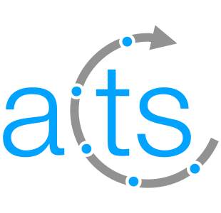

# ALEX

[](https://github.com/stephenswat/alex/actions/workflows/python.yaml)
[](https://github.com/stephenswat/alex/actions/workflows/cxx.yaml)
[](https://unlicense.org/)
[](https://github.com/stephenswat/alex/issues)
[](https://github.com/stephenswat/alex/pulls)
[](https://github.com/stephenswat/alex/commits/main)
[](https://github.com/stephenswat/alex/graphs/contributors)
[](https://github.com/stephenswat/alex/commits/main)

[](https://home.web.cern.ch/)
&nbsp;&nbsp;&nbsp;&nbsp;&nbsp;
[](https://www.uva.nl/)
&nbsp;&nbsp;&nbsp;&nbsp;&nbsp;
[](https://pcs-research.nl/)
&nbsp;
[](https://acts.readthedocs.io/en/latest/)

**ALEX** is an **A**rray **L**ayout **E**volution E**X**periment designed to find
cache-friendly Morton-esque multi-dimensional array layouts for specific
workloads.

## Installation

ALEX is designed to be used with Poetry. It can be installed simply by running
the following command:

```
$ poetry install
```

This requires a C++20-capable compiler to be available.

## Usage

ALEX provides two modes of operation, `alex-evolve` and `alex-bench`. The
evolution command can be used to start an evolution experiment, e.g.:

```
$ poetry run alex-evolve -c caches/AMD_EPYC_7413.yaml -b 10:10 -t Cholesky -g 10 -v -j 3
```

This will run an experiment over 10 generations using 3 cores of Cholesky
decomposition of 2<sup>10</sup> &times; 2<sup>10</sup> arrays with a simulated
AMD EPYC 7413 CPU.

The benchmarking command is used to validate the real-world performance of
layouts, e.g.:

```
$ poetry run alex-bench -c caches/Intel_Xeon_E5_2660_v3.yaml -i input.csv -r 10 -j 40 -o output.csv
```

This will calculate the fitness and actual performance of the layouts in
`input.csv` with 10 repetitions for the benchmark and 40 cores for the fitness
computation.
